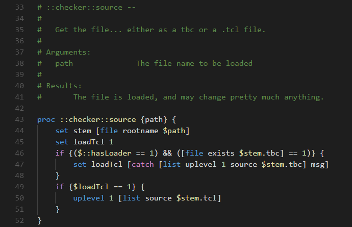

# Tcl for Visual Studio Code

- Language service
  - Syntax highlighting
  - Snippets

If you run into any problems, please file an issue on [GitHub](https://github.com/bitwisecook/vscode-tcl).

## Syntax highlighting

## Snippets

## Code Formatting
A simple code formatter

## Tcl Helpers
Added the "Tcl: Escape Selections to Tcl Quoted String" command to assist with pasting data into iRules.
